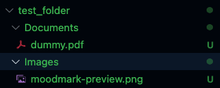

# 🗂️ Folder Organizer


A simple Kotlin CLI tool that organizes files in a folder by extension.
Supports `--dry-run`, `--undo`, and logs actions for safety.

---

## ✅ Features

- Sorts files into folders like `Documents`, `Images`, `Videos`, etc.
- Supports custom extensions mapping
- Clean CLI interface
- Built as a single runnable `.jar` — no setup needed

---

## 🚀 Usage

### 📦 1. Download

Grab the latest `.jar` from [Releases](https://github.com/abhilashini/FolderOrganizer/releases)

---

### 💻 2. Run it

```bash
java -jar FolderOrganizer-fat.jar /path/to/your/folder
```

### ⚙️ 3. Options

| Option      | Description                       |
| ----------- | --------------------------------- |
| (no args)   | Normal run                        |
| `--dry-run` | Simulates organization, no moves  |
| `--undo`    | Reverts the last organization run |
| `--help`    | Shows usage instructions          |


## 🔧 Build from Source
```bash
git clone https://github.com/abhilashini/FolderOrganizer.git
cd FolderOrganizer
./gradlew fatJar
```

## 🧪 Run Tests
```bash
./gradlew test
```

## 📁 Example

#### Before


```bash
$ java -jar app/build/libs/FolderOrganizer-fat.jar test_folder/
Moved: dummy.pdf → Documents/
Moved: moodmark-preview.png → Images/
Done organizing 'test_folder'
```

#### After
